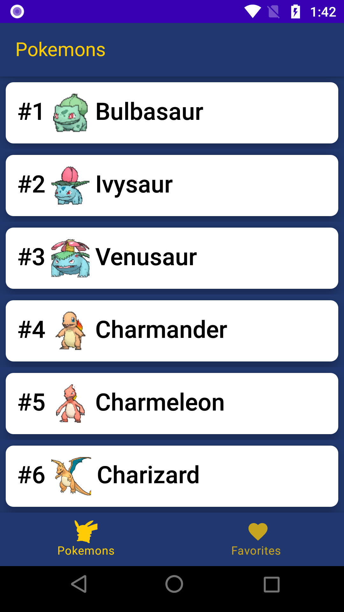

# Retedex - A Pokédex Application

Retedex, a portmanteau of "Retech" and "Pokedex," is a Pokédex application developed for the Android platform. It is designed to consume data from the PokeAPI. Retedex leverages modern Android development techniques and architectural patterns to provide a smooth and intuitive user experience.

## Approach

Retedex follows a clean architecture approach, utilizing Hilt for dependency injection and MVVM (Model-View-ViewModel) for the architectural pattern. The application is designed to be modular and maintainable, with a clear separation of concerns.

### Application Overview

Retedex features an initial list screen showcasing all Pokémon fetched from the API. Each Pokémon entry includes its index, a small image, and its name. Tapping on a Pokémon navigates the user to a detailed screen, displaying a larger image along with additional information such as types, base experience, weight, height, abilities, and moves. Users can mark Pokémon as favorites by clicking the heart icon next to the Pokémon's name. Additionally, Retedex includes a favorites screen where users can view their favorite Pokémon in order of index.

## Project Structure

The project is organized into several packages:

- `core`: Contains implementations of Android tools, API classes, dependency injection, paging, common components for Jetpack Compose, and utility functions.
    - `core.data`: Contains data-related entities.
        - `core.data.local`: Room database implementation including entities and DAOs.
        - `core.data.remote`: Retrofit implementation with API mappings, endpoints, and interceptors.
    - `core.di`: Includes modules and providers for Room and Retrofit.
    - `core.domain.model`: Contains data classes representing the domain model.
    - `core.paging`: Implements pagination logic.
    - `core.presentation`: Contains main screens, navigation configurations, and common components.
    - `core.util`: Includes utility classes and extension functions.

- For each feature, there are corresponding packages:
    - `domain`: Contains domain interfaces.
    - `data`: Implements domain interfaces.
    - `di`: Includes modules and providers for domain and data classes.
    - `presentation`: Composes UI elements, view models, and state classes.

## Technical Details

- **Dependency Injection**: Hilt is utilized for managing dependencies throughout the application.
- **Pagination**: The application fetches Pokémon data in pages to optimize network requests.
- **Data Persistence**: Room is employed for local data storage, enabling the persistence of favorite Pokémon.
- **Jetpack Compose**: UI components are built using Jetpack Compose for a modern and flexible UI development experience.
- **Separation of Concerns**: The project is organized to ensure clear separation of concerns and maintainability.

## Possible Improvements

1. Refine naming conventions for composables to enhance readability.
2. Implement UI and unit tests for better code quality and reliability.

## Libraries Used

Here's a list of libraries used in the project along with their versions:

| Library                    | Version       |
|----------------------------|---------------|
| Activity Compose           | 1.8.2         |
| Core KTX                   | 1.12.0        |
| Hilt Compiler              | 2.48          |
| Lifecycle Runtime KTX      | 2.7.0         |
| Lifecycle ViewModel KTX    | 2.7.0         |
| Material                   | 1.6.4         |
| Navigation Compose         | 2.7.7         |
| Paging3                    | 3.2.1         |
| Room KTX                   | 2.6.1         |
| Coil Compose               | 2.2.2         |
| Converter Gson             | 2.9.0         |
| Gson                       | 2.10.1        |
| Hilt Android               | 2.49          |
| Hilt Compiler              | 2.48          |
| Kotlinx Coroutines Android | 1.7.3         |
| Kotlinx Coroutines Core    | 1.7.3         |
| Logging Interceptor        | 5.0.0-alpha.2 |
| Timber                     | 5.0.1         |
| Material                   | 1.11.0        |

## How to Run

To run the project, follow these steps:

1. Clone the repository from GitHub.
2. Open the project in Android Studio.
3. Connect an Android device or emulator.
4. Build and run the project.

## License

This project is licensed under the MIT License - see the [LICENSE](LICENSE) file for details.
